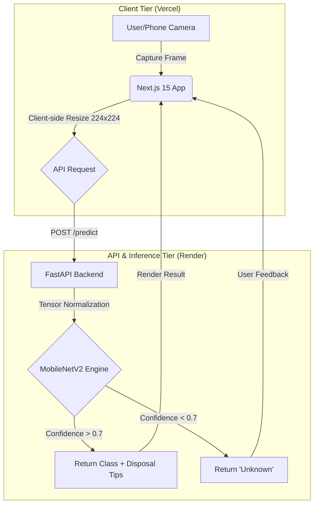

# SmartSort AI ♻️  
**Next-Generation Waste Segregation System**

SmartSort is a full-stack AI platform that uses **Computer Vision** to classify waste in real-time. Designed with a **decoupled three-tier architecture**, it provides instant disposal instructions based on **BBMP (Bengaluru) waste management guidelines**.

---

## 🌐 Live Deployment

🚀 **Frontend (Vercel):**  
https://smart-sort-lac.vercel.app/

---

## 🏛️ System Architecture

The project follows a **Decoupled Three-Tier Architecture** to ensure scalability, separation of concerns, and high availability.




### 🔹 1. Client Tier (Frontend)
- **Framework:** Next.js 15 (App Router)
- **Camera Handling:** MediaDevices API + React-Webcam
- **Preprocessing:** Resizes images to **224×224** before sending to backend
- **UI:** Tailwind CSS for real-time feedback
- **State Management:** Scan history & prediction results

### 🔹 2. API Tier (Backend)
- **Framework:** FastAPI (Python 3.10)
- Accepts `multipart/form-data`
- Normalizes tensors to `[0,1]`
- Handles CORS securely
- Acts as REST bridge between UI and ML model

### 🔹 3. Inference Tier (ML Engine)
- **Model:** MobileNetV2 (Transfer Learning – Functional API)
- **Confidence Guard:** 0.70 threshold to prevent false positives
- Optimized for real-world lighting conditions

---

## 📋 Disposal Guidelines (BBMP Mapping)

The system doesn’t just classify waste — it maps predictions to **local Bengaluru segregation rules** to encourage proper disposal at source.

| Category      | Item Types                          | Disposal Instruction |
|--------------|--------------------------------------|----------------------|
| 🔋 Hazardous | Battery                              | Take to designated e-waste collection centers. |
| 🌱 Organic   | Biological                           | Place in the **Green Compost Bin**. |
| ♻️ Recyclable | Plastic, Glass, Metal, Cardboard     | Rinse and place in the **Dry Waste (Blue) Bin**. |
| 👕 Textile   | Clothes, Shoes                       | Donate if usable, else use textile recycling. |
| 🗑️ General   | Trash                                | Dispose of in the **Landfill (Red) Bin**. |

---

## 📊 Performance Metrics

- **Validation Accuracy:** 91%  
- **Training Accuracy:** 97%  
- **Model Architecture:** MobileNetV2  
- **Total Classes:** 12  

### 📦 Supported Classes
Battery, Biological, Brown-Glass, Cardboard, Clothes, Glass, Metal, Paper, Plastic, Shoes, Trash, White-Glass

---

## 🛠️ Technical Stack

### 🎨 Frontend
- Next.js 15 (App Router)
- Tailwind CSS
- React-Webcam

### ⚙️ Backend
- FastAPI
- Uvicorn
- Python 3.10

### 🤖 Machine Learning
- TensorFlow 2.x
- Keras
- NumPy
- Pillow

### 🚀 DevOps & Deployment
- GitHub (Version Control & CI/CD)
- Vercel (Frontend Hosting)
- Render (Backend Deployment)

---

## 🚀 Getting Started

### 1️⃣ Backend Setup

```bash
cd backend
python -m venv venv
source venv/bin/activate        # Windows: venv\Scripts\activate
pip install -r requirements.txt
uvicorn main:app --reload
```

---

### 2️⃣ Frontend Setup

Create a `.env.local` file inside the frontend directory:

```
NEXT_PUBLIC_API_URL=http://localhost:8000
```

Then run:

```bash
cd frontend
npm install
npm run dev
```

---

## 💡 Engineering Highlights

- ✅ Confidence Threshold (0.70) prevents incorrect classifications  
- ✅ Client-Side Preprocessing (224×224) reduces server load  
- ✅ Cold-Start Optimization via warm-up ping strategy  
- ✅ Decoupled Deployment for independent frontend/backend scaling  

---

## 👨‍💻 Team

**Team Lead:**  
Md Yusuf Ali  

**Team Members:**  
- Mohammad Zuhaib Wani  
- Mohammed Zain  
- Mohammed Hashir  

---

## 🌍 Impact

SmartSort promotes:
- Proper waste segregation at source  
- Reduced landfill dependency  
- Improved recycling efficiency  
- AI-driven urban sustainability  

---

### ♻️ Segregate Smart. Keep Bengaluru Clean.