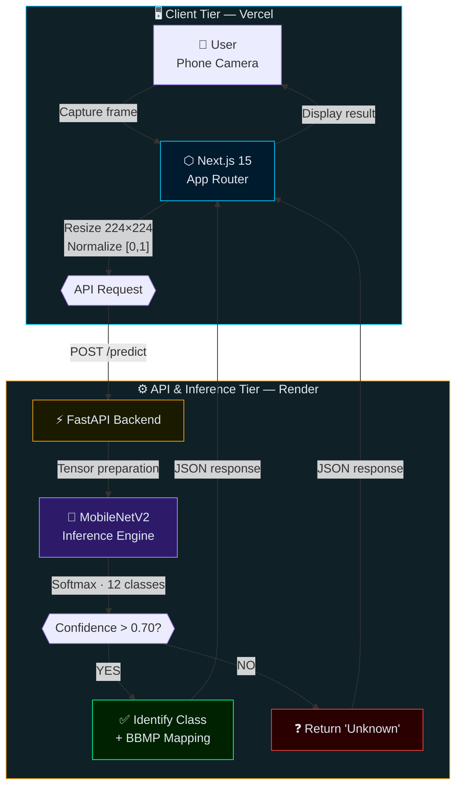
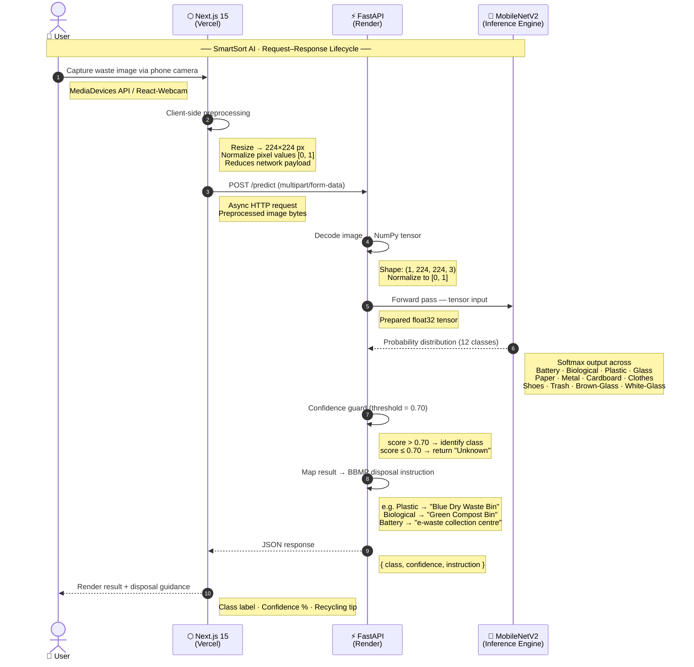

# SmartSort AI ♻️
**Next-Generation AI-Powered Waste Segregation System**

> A full-stack Computer Vision platform that classifies waste in real-time and provides instant, localized disposal guidance based on **BBMP (Bengaluru) waste management guidelines**.

[](https://smart-sort-lac.vercel.app/)
[](https://github.com/Yusufali2004/smart-sort)
[](https://github.com/Yusufali2004/smart-sort)
[](https://github.com/Yusufali2004/smart-sort)

---

## 📑 Table of Contents

- [Live Deployment](#-live-deployment)
- [System Architecture](#-system-architecture)
- [Request–Response Lifecycle](#-requestresponse-lifecycle--sequence-diagram)
- [Component Pipeline](#-component-pipeline)
- [Disposal Guidelines](#-disposal-guidelines-bbmp-mapping)
- [Performance Metrics](#-performance-metrics)
- [Technical Stack](#-technical-stack)
- [Getting Started](#-getting-started)
- [Engineering Highlights](#-engineering-highlights)
- [Team](#-team)
- [Impact](#-impact)

---

## 🌐 Live Deployment

| Service | Platform | URL |
|---------|----------|-----|
| 🎨 Frontend | Vercel | [smart-sort-lac.vercel.app](https://smart-sort-lac.vercel.app/) |
| ⚡ Backend API | Render | REST `/predict` endpoint |

---

## 🏛️ System Architecture

SmartSort follows a **Decoupled Three-Tier Architecture** to ensure scalability, separation of concerns, and high availability. Each tier is independently deployable and scalable.



### 🔹 Tier 1 — Client (Frontend)
- **Framework:** Next.js 15 (App Router)
- **Camera Handling:** MediaDevices API + React-Webcam
- **Preprocessing:** Resizes and normalizes images to **224×224** client-side before transmission
- **UI:** Tailwind CSS with real-time feedback and scan history
- **State Management:** Prediction results and scan history persisted in React state

### 🔹 Tier 2 — API (Backend)
- **Framework:** FastAPI (Python 3.10) via Uvicorn
- Accepts `multipart/form-data` image uploads
- Normalizes pixel tensors to `[0, 1]`
- Handles CORS securely for cross-origin frontend requests
- Acts as REST bridge between the UI and the ML inference engine

### 🔹 Tier 3 — Inference (ML Engine)
- **Model:** MobileNetV2 (Transfer Learning — Functional API)
- **Confidence Guard:** 0.70 threshold prevents false-positive classifications
- Optimized for real-world variable lighting conditions

---

## 🔄 Request–Response Lifecycle — Sequence Diagram

Full end-to-end flow from camera capture to disposal guidance display:



---

## 🔧 Component Pipeline


---

## 📋 Disposal Guidelines (BBMP Mapping)

SmartSort doesn't just classify waste — it maps every prediction to **Bengaluru's BBMP segregation rules**, encouraging correct disposal at the source.

| Category | Item Types | Disposal Instruction |
|----------|------------|----------------------|
| 🔋 Hazardous | Battery | Take to designated e-waste collection centers. |
| 🌱 Organic | Biological | Place in the **Green Compost Bin**. |
| ♻️ Recyclable | Plastic, Glass, Metal, Cardboard | Rinse and place in the **Dry Waste (Blue) Bin**. |
| 👕 Textile | Clothes, Shoes | Donate if usable, else use textile recycling drop-off. |
| 🗑️ General | Trash | Dispose of in the **Landfill (Red) Bin**. |

---

## 📊 Performance Metrics

| Metric | Value |
|--------|-------|
| ✅ Validation Accuracy | **91%** |
| 🏋️ Training Accuracy | **97%** |
| 🧠 Model Architecture | **MobileNetV2** |
| 📦 Total Classes | **12** |
| 📐 Input Dimensions | **224 × 224 × 3** |
| 🛡️ Confidence Threshold | **0.70** |

### 📦 Supported Waste Classes

| # | Class | # | Class |
|---|-------|---|-------|
| 1 | 🔋 Battery | 7 | ⚙️ Metal |
| 2 | 🧫 Biological | 8 | 📄 Paper |
| 3 | 🟤 Brown-Glass | 9 | 🧴 Plastic |
| 4 | 📦 Cardboard | 10 | 👟 Shoes |
| 5 | 👕 Clothes | 11 | 🗑️ Trash |
| 6 | 🫙 Glass | 12 | ⬜ White-Glass |

---

## 🛠️ Technical Stack

### 🎨 Frontend
| Tool | Purpose |
|------|---------|
| Next.js 15 (App Router) | UI framework & routing |
| Tailwind CSS | Utility-first responsive styling |
| React-Webcam | Camera access & frame capture |

### ⚙️ Backend
| Tool | Purpose |
|------|---------|
| FastAPI | REST API framework |
| Uvicorn | ASGI production server |
| Python 3.10 | Runtime |

### 🤖 Machine Learning
| Tool | Purpose |
|------|---------|
| TensorFlow 2.x | Deep learning framework |
| Keras | High-level model API |
| MobileNetV2 | Transfer learning base model |
| NumPy | Tensor operations |
| Pillow | Image decoding & preprocessing |

### 🚀 DevOps & Deployment
| Tool | Purpose |
|------|---------|
| GitHub | Version control & CI/CD |
| Vercel | Frontend hosting (CDN + edge) |
| Render | Backend hosting (auto-deploy) |

---

## 🚀 Getting Started

### Prerequisites
- Python 3.10+
- Node.js 18+
- Git

### 1️⃣ Clone the Repository

```bash
git clone https://github.com/Yusufali2004/smart-sort.git
cd smart-sort
```

### 2️⃣ Backend Setup

```bash
cd backend
python -m venv venv
source venv/bin/activate        # Windows: venv\Scripts\activate
pip install -r requirements.txt
uvicorn main:app --reload
```

Backend runs at: `http://localhost:8000`  
API docs available at: `http://localhost:8000/docs`

### 3️⃣ Frontend Setup

Create a `.env.local` file inside the `frontend/` directory:

```env
NEXT_PUBLIC_API_URL=http://localhost:8000
```

Then run:

```bash
cd frontend
npm install
npm run dev
```

Frontend runs at: `http://localhost:3000`

---

## 💡 Engineering Highlights

| Feature | Description |
|---------|-------------|
| 🛡️ Confidence Threshold | 0.70 guard prevents incorrect or ambiguous classifications from reaching the user |
| ⚡ Client-Side Preprocessing | 224×224 resize & normalization on the edge reduces backend load and latency |
| 🔥 Cold-Start Optimization | Warm-up ping strategy ensures the Render backend is ready on first request |
| 🔀 Decoupled Deployment | Frontend and backend scale independently with zero coupling |
| 🗺️ BBMP Mapping | Every class maps to a real Bengaluru disposal rule — not just a label |

---

## 👨‍💻 Team

**Team Lead**
- [Md Yusuf Ali](https://github.com/Yusufali2004)

**Team Members**
- [Mohammad Zuhaib Wani](https://github.com/Zuhaib-01)
- [Mohammed Zain](https://github.com/zainchisti)
- [Mohammed Hashir](https://github.com/Hash-ir777)

> Department of Computer Science & Engineering, HKBKCE-VTU

---

## 🌍 Impact

SmartSort directly contributes to:

- ♻️ **Proper waste segregation at source** — reducing contamination of recyclables
- 🏙️ **Reduced landfill dependency** — diverting recyclables and compostables away from dumps
- 📈 **Improved recycling efficiency** — by giving actionable, bin-specific guidance
- 🤖 **AI-driven urban sustainability** — aligning with BBMP's Smart City initiatives

---

<div align="center">

### ♻️ Segregate Smart. Keep Bengaluru Clean.

⭐ Star this repo if you found it useful!

</div>
